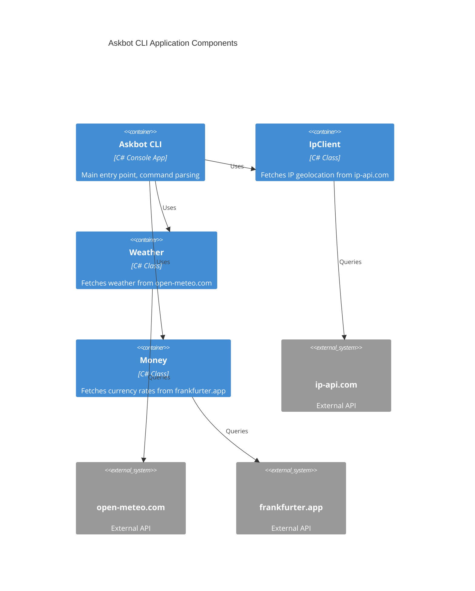

# Structure for Askbot

## Overview

Askbot is a CLI educational tool that queries public APIs to provide basic information from the user's IP and associated services: location, weather, currency, and sun. The objective is to demonstrate practical experience in consuming REST APIs and handling JSON data in a console application.

## Bill of Materials

- **Language**: C#
- **Framework**: .NET 8.0
- **State Management**: None (stateless CLI)
- **Styling**: Console output with emojis and formatted text
- **Testing**: xUnit
- **Build Tools**: .NET CLI (dotnet)

### Development / Deployment workflow

1. Clone the repository: `git clone https://github.com/AlbertoBasaloAcademy/inetum_copilot-csharp.git`
2. Navigate to the project: `cd inetum_copilot-csharp/src/Askbot`
3. Build: `dotnet build`
4. Run: `dotnet run --project ./src/Askbot` (shows location) or `dotnet run --project ./src/Askbot -- weather` (shows weather)
5. Test: `dotnet test` from the tests directory

The application is deployed as an executable console app, no special deployment steps required beyond building and distributing the binary.

## Folder Structure

```
inetum_copilot-csharp/
├── LICENSE
├── README.md
├── docs/
│   ├── activity-bookings.en.PRD.md
│   ├── activity-bookings.PRD.md
│   ├── alumnos.txt
│   ├── ask-bot.en.PRD.md
│   ├── ask-bot.PRD.md
│   ├── journal.md
│   ├── specs/
│   │   └── 1-Weather forecast.spec.md
│   └── (other PDFs and docs)
├── src/
│   └── Askbot/
│       ├── Askbot.csproj
│       ├── Askbot.sln
│       ├── IpApi.cs
│       ├── IpClient.cs
│       ├── Money.cs
│       ├── Program.cs
│       └── Weather.cs
└── tests/
    └── Askbot.Tests/
        ├── Askbot.Tests.csproj
        └── WeatherTests.cs
```

### Key files

- **`src/Askbot/Program.cs`**: Main entry point, handles CLI arguments and commands (weather, money)
- **`src/Askbot/IpApi.cs`**: Record type for IP geolocation data
- **`src/Askbot/IpClient.cs`**: Client for fetching IP and location info from ip-api.com
- **`src/Askbot/Weather.cs`**: Client for fetching weather data from open-meteo.com
- **`src/Askbot/Money.cs`**: Client for fetching currency and exchange rates from frankfurter.app
- **`tests/Askbot.Tests/WeatherTests.cs`**: Unit tests for weather functionality
- **`docs/ask-bot.PRD.md`**: Product Requirements Document detailing features and APIs

## Components diagram



> End of STRUCTURE for Askbot, last updated on October 2, 2025.